# praktikumm-25-565484

## Deskripsi
Project ini merupakan praktikum Git yang mencakup penggunaan commit, branching, merge, dan rebase.

## Cara Menjalankan
1. Clone repository
2. Buka file index.html di browser

## Tugas 1
Dilakukan pembuatan repository dan beberapa commit menggunakan Conventional Commits. Melakukan minimal 5 commit menggunakan Conventional Commits:
- feat: menambahkan halaman utama
- style: memperbaiki tampilan
- fix: memperbaiki bug
- chore: menambahkan .gitignore

## Git Log

Commit History: 
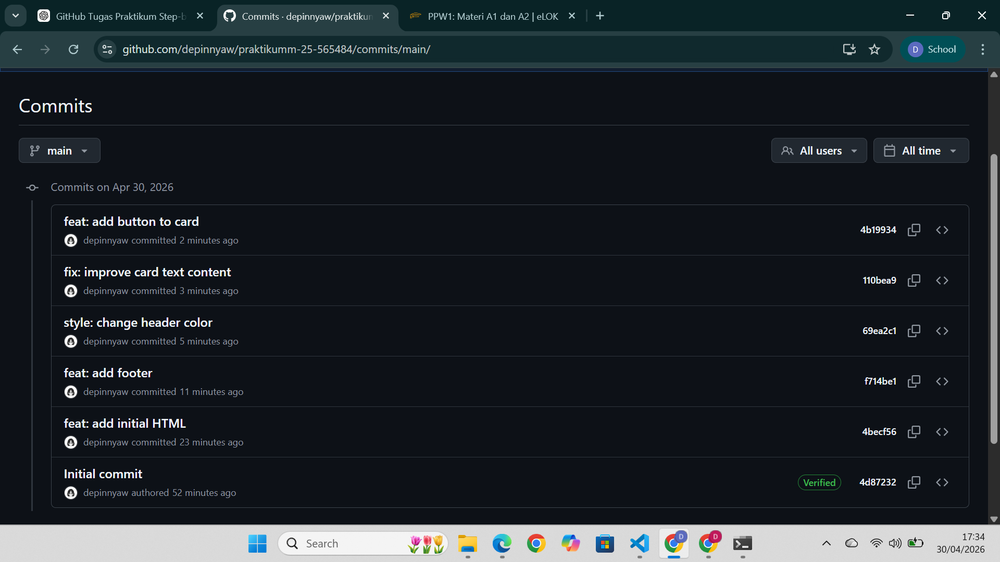

## Tugas 2 
Membuat branch feature/navbar, feature/footer, dan hotfix/typo, lalu membuat Pull Request dan merge ke main. Merge dilakukan dengan: 
- Squash and merge untuk feature
- Merge commit untuk hotfix

1. Feature Navbar  
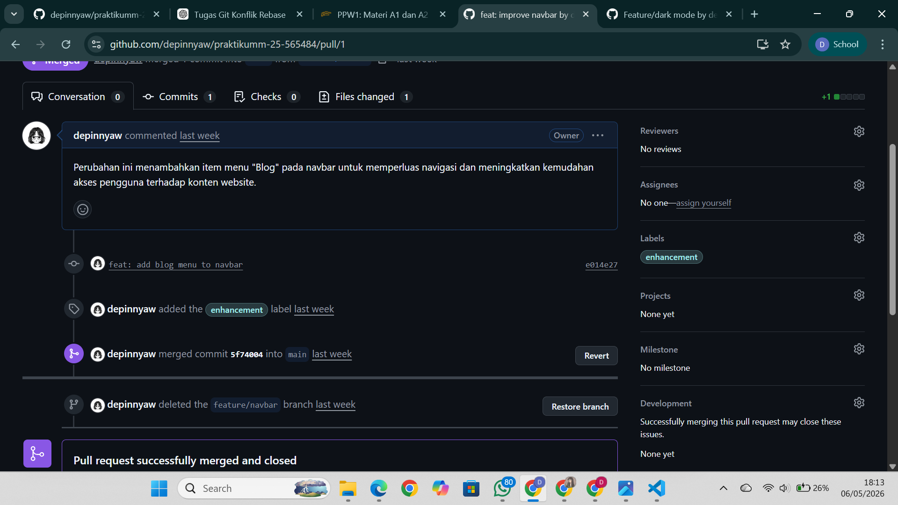

2. Feature Footer  
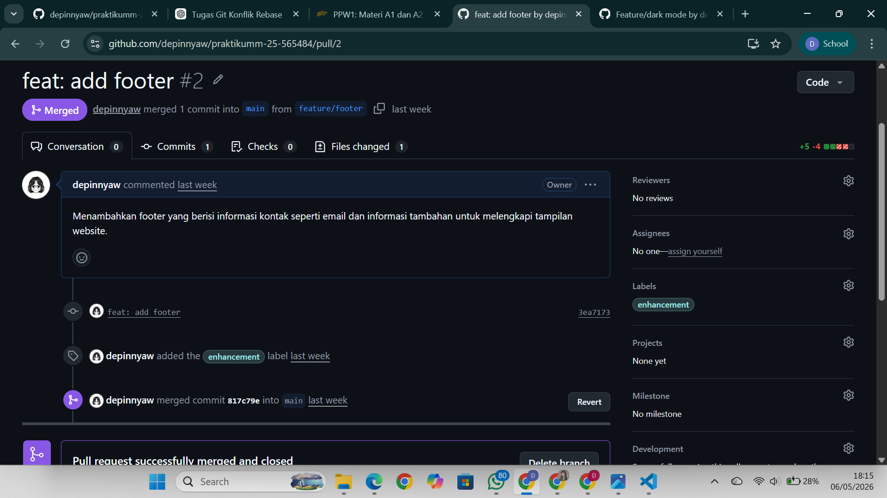

3. Hotfix Typo  
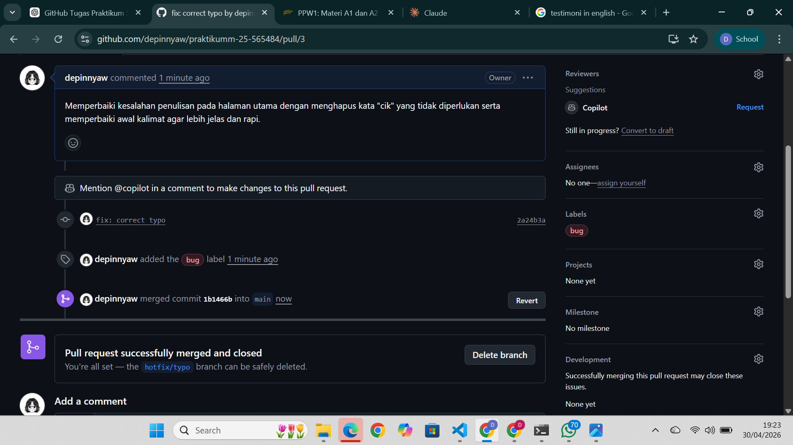

Menerapkan Branch protection rule untuk mencegah push langsung ke main.

## Branch Protection
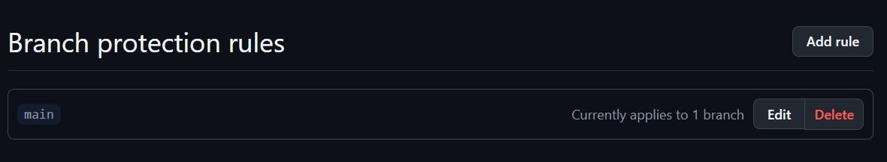

## Tugas 3
- experiment/color-A
- experiment/color-B
Konflik terjadi karena kedua branch mengubah bagian CSS yang sama.

1. Konflik: 
Konflik diselesaikan secara manual di VS Code dengan memilih perubahan yang sesuai. 
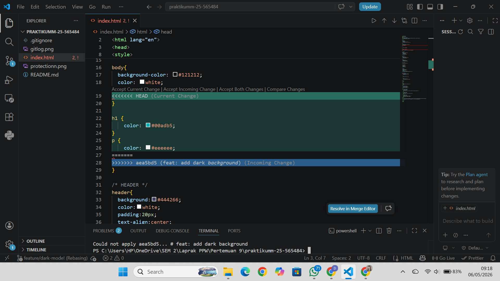

2. Menyelesaikan Konflik
Konflik terjadi karena dua branch mengubah bagian CSS yang sama. Konflik diselesaikan dengan memilih perubahan yang sesuai. 
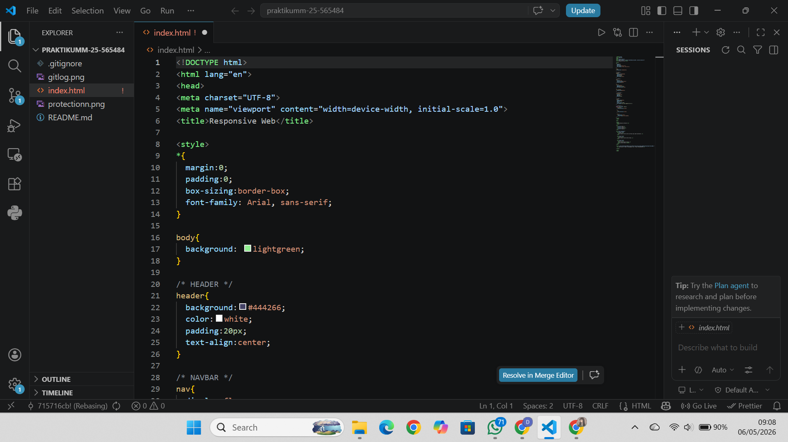

Dilakukan interactive rebase untuk menggabungkan beberapa commit menjadi satu commit agar riwayat lebih rapi.
3. Sebelum rebase: 
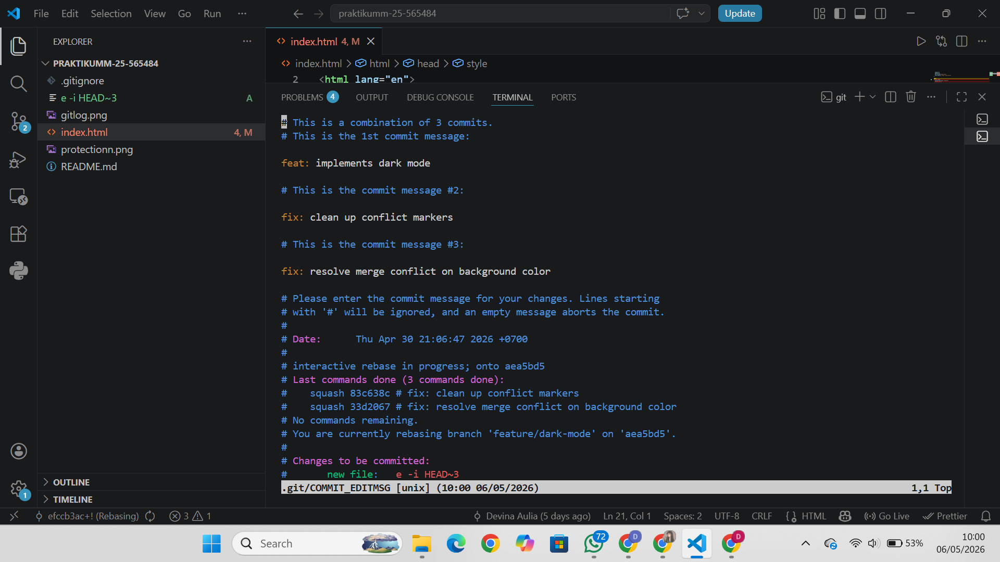

4. Hasil Akhir:
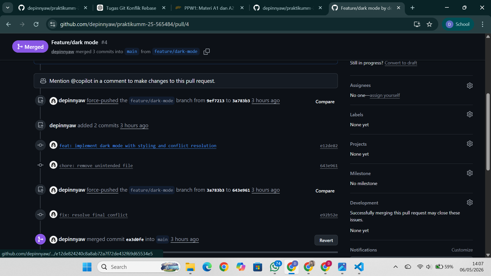

## Tugas 4 
1. Dibuat minimal 3 issues: 
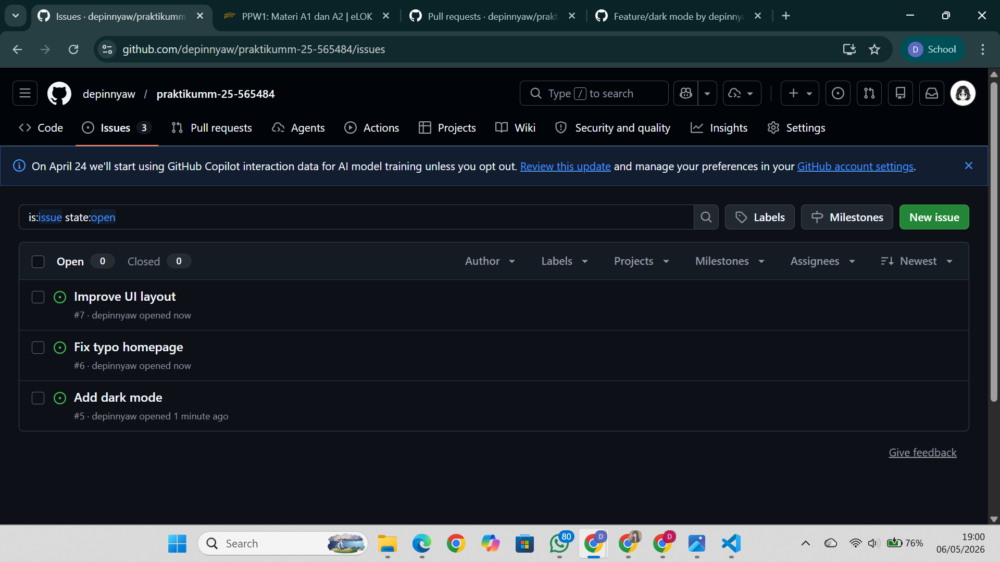

2. Menutup Issue menggunakan PR:
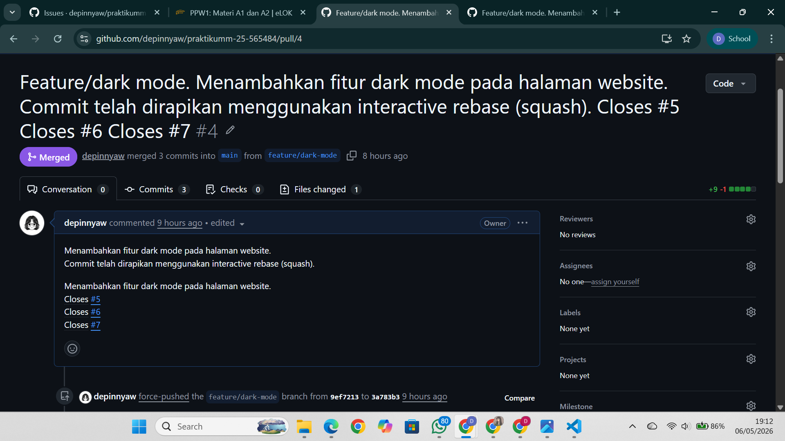

## Collaborator
Menambahkan collaborator pada repository. 
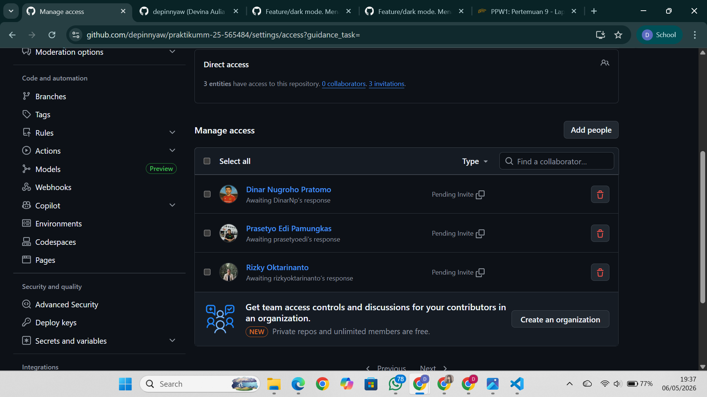

### Release
Membuat release versi v1.0.0.
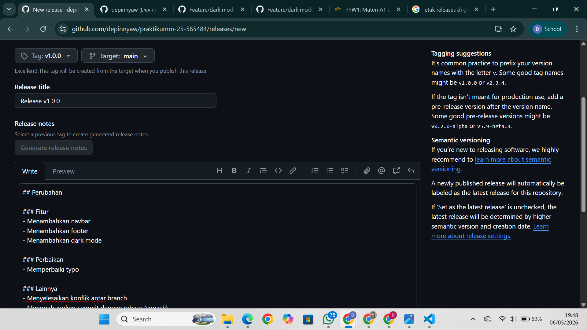

Hasil release: 
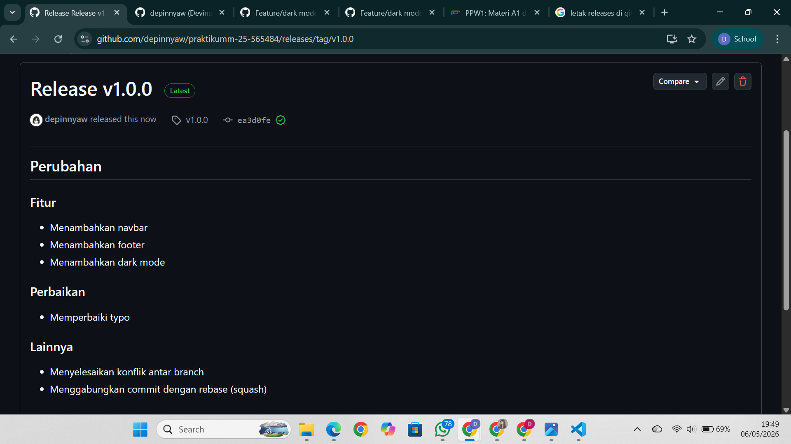

## Dokumentasi Git Command
- git clone → mengambil repository
- git add → menambahkan perubahan
- git push → mengirim perubahan ke GitHub
- git pull → mengambil update terbaru dari repository
- git commit → menyimpan perubahan
- git branch → membuat branch
- git merge → menggabungkan branch
- git rebase → merapikan commit